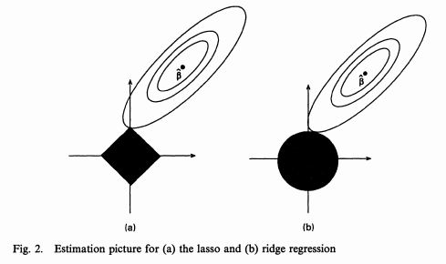
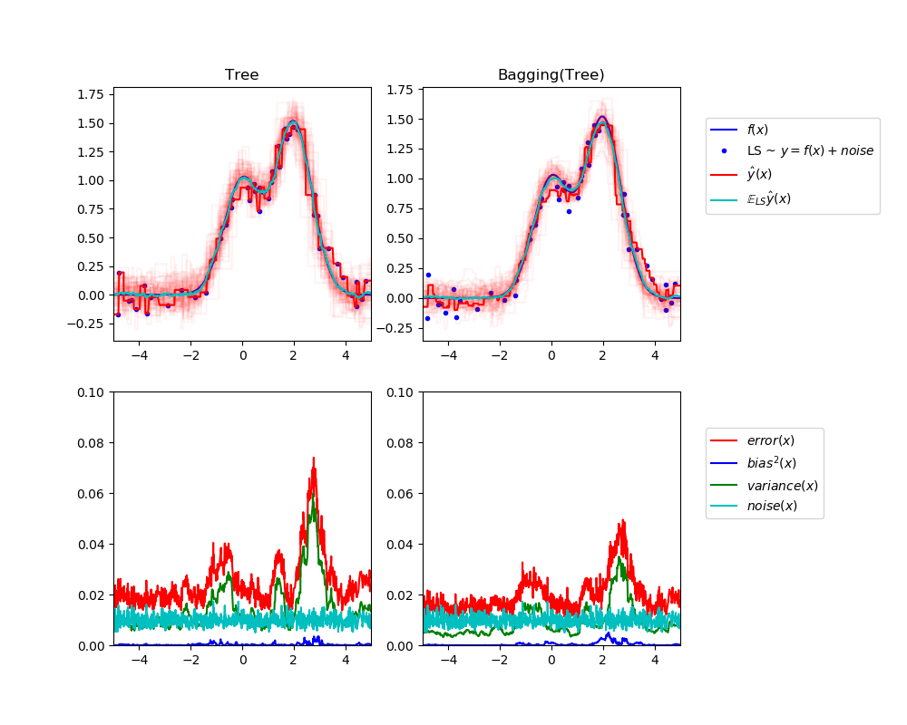
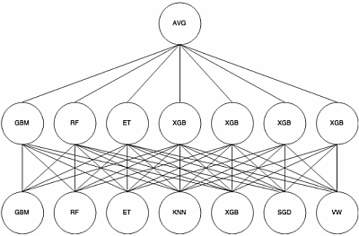
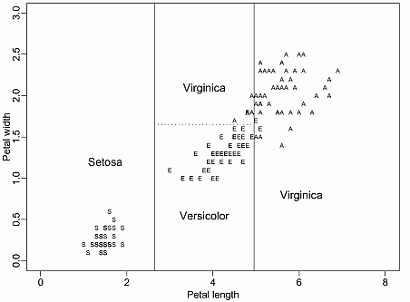
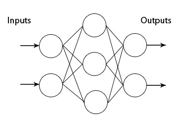
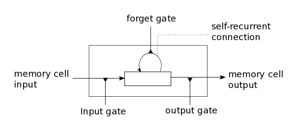

# Data Science question-answer

* [Resume](#resume)
* [SQL](#sql)
* [Tools and Framework](#tools-and-framework)
* [Statistics and ML In General](#statistics-and-ml-in-general)
* [Supervised Learning](#supervised-learning)
* [Unsupervised Learning](#unsupervised-learning)
* [Reinforcement Learning](#reinforcement-learning)
* [Natural Language Processing](#natural-language-processing)

## Resume
Cовет, который я могу дать о резюме - 

> Trained a machine learning system

or

> Designed and deployed a deep learning model to recognize objects using Keras, Tensorflow, and Node.js. The model has 1/30 model size, 1/3 training time, 1/5 inference time, and 2x faster convergence compared with traditional neural networks (e.g, ResNet)

Второй вариант гораздо лучше, потому что он количественно оценивает ваш вклад, а также выделяет конкретные технологии, которые вы использовали (показыват вас опытным). Это потребует от вас регистрации того, что вы сделали во время экспериментов. Но не стоит преувеличивать.
Потратьте некоторое время на просмотр вашего резюме/ прошлых проектов, чтобы убедиться, что вы хорошо их объясняете.

## SQL

* [Difference between joins](#difference-between-joins)

### Difference between joins

* **(INNER) JOIN**: Возвращает записи, имеющие общие значения в обеих таблицах
* **LEFT (OUTER) JOIN**: Возвращает записи из левой таблицы и совпадающих записи из правой таблицы
* **RIGHT (OUTER) JOIN**: Возвращает записи из правой таблицы и совпадающие записи из левой таблицы
* **FULL (OUTER) JOIN**: Возвращает записи при наличии совпадения в левой или правой таблице

[back to top](#data-science-question-answer)

## Tools and Framework

Ресурсы здесь предназначены только для того, чтобы помочь вам освежить память, а не сделать вас экспертом.

* [Spark](#spark)

### Spark

Использование PySpark API.

* Самый лучший ресурс это конечно же [Spark's documentation](https://spark.apache.org/docs/latest/). Тщательно просмотрите все темы.
* Если вы действительно ограничены во времени, просмотрите шпаргалку по Spark  [PySpark cheat sheet](https://s3.amazonaws.com/assets.datacamp.com/blog_assets/PySpark_Cheat_Sheet_Python.pdf) 

[back to top](#data-science-question-answer)

## Statistics and ML In General

* [Project Workflow](#project-workflow)
* [Cross Validation](#cross-validation)
* [Feature Importance](#feature-importance)
* [Mean Squared Error vs. Mean Absolute Error](#mean-squared-error-vs.-mean-absolute-error)
* [L1 vs L2 regularization](#l1-vs-l2-regularization)
* [Correlation vs Covariance](#correlation-vs-covariance)
* [Would adding more data address underfitting](#would-adding-more-data-address-underfitting)
* [Activation Function](#activation-function)
* [Bagging](#bagging)
* [Stacking](#stacking)
* [Generative vs discriminative](#generative-vs-discriminative)
* [Parametric vs Nonparametric](#parametric-vs-nonparametric)
* [Recommender System](#recommender-system)

### Project Workflow

Имея проект data science/machine learning, какие шаги мы должны предпринять для получения результата?

*  **Specify business objective.** Пытаемся ли мы завоевать больше клиентов, добиться более высокой удовлетворенности или получить больше доходов?
*  **Define problem.** Какова пропасть между идеальным миром и реальным, который требует машинного обучения, чтобы заполнить её? Определите задачи, которые могут быть решены с помощью алгоритмов ML.
* **Create a common sense baseline.** Но прежде чем вы прибегнете к ML, установите базовый уровень для решения проблемы, как будто вы не знаете ML. Вы можете быть поражены тем, насколько эффективен этот базовый уровень. Он может быть к примеру таким: рекомендовать лучшие N популярных элементов или другую логику, основанную на простых правилах. Этот базовый уровень также может служить хорошим ориентиром для алгоритмов ML.
* **Review ML literatures.**  Чтобы избежать изобретения колеса и получить вдохновение на то, какие методы / алгоритмы хороши для решения задач.
* **Set up a single-number metric.**  Что значит быть успешным - высокая точность, меньшая погрешность или больший AUC - и как вы его измеряете? Метрика должна соответствовать целям высокого уровня, чаще всего успеху вашего бизнеса. Установите одно число, по которому будут измеряться все модели.
* **Do exploratory data analysis (EDA).** Играйте с данными, чтобы получить общее представление о типе данных, распределении, переменной корреляции, фасетах и т.д. Этот шаг будет связан с большим количеством графиков.
* **Partition data.** Проверочный набор должен быть достаточно большим, чтобы обнаружить различия между моделями, которые вы тренируете; тестовый набор должен быть достаточно большим, чтобы показать общую производительность конечной модели; обучающий набор, само собой разумеется, чем больше, тем веселее.
* **Preprocess.**  Это будет включать интеграцию данных, очистку, преобразование, сокращение, дискретизацию и многое другое.
* **Engineer features.** Придумывать особенности сложно, отнимает много времени, требует экспертных знаний. Прикладное машинное обучение-это в основном  feature engineering. Этот шаг обычно включает в себя выбор и создание объектов с использованием знаний предметной области. Может быть минимальным для проектов глубокого обучения.
* **Develop models.** Выберите, какой алгоритм использовать, какие гиперпараметры настраивать,какую архитектуру использовать и т.д.
* **Ensemble.** Ансамбль обычно может повысить производительность, в зависимости от корреляций моделей/функций. Так что это всегда хорошая идея, чтобы попробовать. Но будьте внимательны - некоторые ансамбли слишком сложны/медлительны, чтобы их можно было запустить в производство.
* **Deploy model.** Развертывание моделей в производственном процессе для вывода.
* **Monitor model.** Мониторинг производительности модели и сбор обратных связей.
* **Iterate.** Повторите предыдущие шаги. ML, как правило, представляет собой итеративный процесс, при котором с течением времени разрабатываются новые и улучшенные модели.

[back to top](#data-science-question-answer)

### Cross Validation

Перекрестная проверка - это метод оценки прогностических моделей путем разбиения исходной выборки на обучающий набор для обучения модели и валидационный набор для ее оценки. Например, перекрестная проверка k-кратности делит данные на k блоков (или секций), тренируется на каждом K-1 блоке и проверяется на оставшемся 1 блоке. Это приводит к k моделям/оценкам, которые могут быть усреднены для получения общей производительности модели.

[back to top](#data-science-question-answer)

### Feature Importance
* В линейных моделях важность признаков может быть рассчитана по шкале коэффициентов
* В древовидных методах (таких как случайный лес) важные объекты, скорее всего, появятся ближе к корню дерева. Мы можем получить значение признака для случайного леса, вычисляя глубину усреднения, при которой он появляется на всех деревьях в лесу.

[back to top](#data-science-question-answer)

### Mean Squared Error vs. Mean Absolute Error

* **Сходство**: оба измеряют среднюю ошибку предсказания модели; диапазон от 0 до бесконечности; чем ниже, тем лучше
* Среднеквадратичная ошибка (MSE) дает более высокие веса большей ошибке (например, ошибка на 10 более чем в два раза хуже, чем ошибка на 5), в то время как средняя абсолютная ошибка (MAE) присваивает равные веса (Ошибиться на 10 в два раза хуже, чем на 5)
* MSE непрерывно дифференцируема, MAE-нет (где y_pred == y_true)

[back to top](#data-science-question-answer)

### L1 vs L2 regularization

* **Сходство**: регуляризация L1, как и регуляризация L2 **предотвращают переобучение** путем сокращения (наложения штрафа) коэффициентов
* **Разница**: L2 (Ridge-хребет) сжимает все коэффициенты на те же пропорции, но не устраняет ни одного, в то время как L1 (лассо) может сжать некоторые коэффициенты до нуля, выполняя выбор признаков.
* **Что выбрать**: если все признаки коррелируют с меткой, то Ridge превосходит лассо, так как коэффициенты никогда не равны нулю в Ridge. Если только подмножество признаков коррелирует с меткой, лассо превосходит Ridge, так как в модели лассо некоторый коэффициент может быть уменьшен до нуля.

* На графике (а) Черный Квадрат представляет допустимую область регуляризации L1, а график (б) - допустимую область регуляризации L2. Контуры на графиках представляют различные значения потерь (для модели неограниченной регрессии ). Допустимая точка, которая минимизирует потери, с большей вероятностью произойдет на координатах на графике (а), чем на графике (Б), поскольку график (а) является более **угловым**. Этот эффект усиливается, когда ваше число коэффициентов увеличивается, т. е. от 2 до 200. Следствием этого является то, что регуляризация L1 дает вам разреженные оценки. А именно, в высокомерном пространстве вы получаете в основном нули и небольшое количество ненулевых коэффициентов.

[back to top](#data-science-question-answer)

### Correlation vs Covariance

* Как определить взаимосвязь, и измерить зависимость между двумя случайными величинами
* Корреляция - это когда изменение одного элемента может привести к изменению другого элемента, в то время как ковариация - это когда два элемента изменяются вместе (совместная изменчивость)
* Ковариация - это не что иное, как мера корреляции. Напротив, корреляция относится к масштабированной форме ковариации
* Диапазон: корреляция находится между -1 и +1, в то время как ковариация лежит между отрицательной бесконечностью и бесконечностью.

[back to top](#data-science-question-answer)

### Would adding more data address underfitting

Недообучение происходит, когда модель недостаточно сложна, чтобы хорошо учиться на основе данных. Это проблема модели, а не размера данных. Таким образом, потенциальный способ решения проблемы Недообучение - это увеличение сложности модели (например, добавление коэффициентов более высокого порядка для линейной модели, увеличение глубины для древовидных методов, добавление большего количества слоев / количества нейронов для нейронных сетей и т. д.)

[back to top](#data-science-question-answer)

### Activation Function

Для нейронных сетей

* Non-linearity: часто используется ReLU. Используйте Leaky ReLU (не большой положительный градиент для отрицательного входного сигнала, скажем, 'y = 0.01 x', когда x < 0) для решения проблемы мертвого ReLU
* Multi-class: softmax
* Binary: sigmoid
* Regression: linear

[back to top](#data-science-question-answer)

### Bagging

Для решения проблемы переобучения мы можем использовать ансамблевый метод, называемый bagging (bootstrap aggregating),
что уменьшает дисперсию алгоритма мета-обучения. Bagging может быть применён
к дереву решений или другим алгоритмам.

Вот [хорошая иллюстрация](http://scikit-learn.org/stable/auto_examples/ensemble/plot_bias_variance.html#sphx-glr-auto-examples-ensemble-plot-bias-variance-py) одного оценщика  vs. bagging.

*  Bagging - это когда samlping выполняется с *заменой*. Когда sampling выполняется без замены, это называется pasting.
* Bagging популярен не только из-за его повышения производительности, но также и из-за того, что отдельные учащиеся могут обучаться параллельно и хорошо масштабироваться
* Ансамблевые методы лучше всего работают, когда учащиеся максимально независимы друг от друга
* Голосование:  soft voting (прогнозируемая вероятность и среднее значение по всем отдельным учащимся) часто работает лучше, чем жесткое голосование (hard voting)

[back to top](#data-science-question-answer)

### Stacking

* Вместо использования тривиальных функций (таких как жесткое голосование) для агрегирования прогнозов от отдельных учащихся, обучите модель выполнять это агрегирование
* Сначала разбейте обучающий набор на два подмножества: первое подмножество используется для обучения обучающихся на первом уровне
* Далее учащиеся первого уровня используются для создания прогнозов (мета-объектов) на втором подмножестве, и эти прогнозы используются для обучения других моделей (для получения Весов различных учащихся) на втором уровне.
* Мы можем обучить несколько моделей во втором слое, но это влечет за собой разбиение исходного набора данных на 3 части

[back to top](#data-science-question-answer)

### Generative vs discriminative

* Модель дискриминативных алгоритмов *p(y|x; w)*, то есть заданный набор данных и изученный
параметр, какова вероятность, что y, принадлежащих к определенному классу. Дискриминационный алгоритм
не заботясь о том, как были сгенерированы данные, он просто классифицирует данный пример
* Генеративные алгоритмы пытаются моделировать *p (x|y)*, то есть распределение заданных признаков
что он принадлежит к определенному классу. Генеративный алгоритм моделирует, как были получены данные, сгенерированны.

> Учитывая обучающий набор, такой алгоритм, как логистическая регрессия или
> алгоритм персептрона (в основном) пытается найти прямую линию —то есть
> граница принятия решения - это то, что разделяет слонов и собак. Затем, чтобы классифицировать
> новое животное, как слон или собака, она проверяет, с какой стороны от неё находится собака.

> Вот другой подход. Во-первых, глядя на слонов, мы можем построить
> модель того, как выглядят слоны. Затем, глядя на собак, мы можем построить
> отдельную модель того, как выглядят собаки. Наконец, чтобы классифицировать новое животное, мы
> можно сопоставить новое животное с моделью слона и сопоставить его с моделью слона, чтобы увидеть, 
  будет ли новое животное больше похоже на слонов
- или больше похоже на тех собак, которые были в тренировочном наборе.

[back to top](#data-science-question-answer)

### Parametric vs Nonparametric

* Модель обучения, которая суммирует данные с набором параметров фиксированного размера (независимо от количества обучающих примеров), называется параметрической моделью.
* Модель, в которой количество параметров не определяется до начала обучения. Непараметрические не означают, что у них нет параметров. Напротив, непараметрические модели (can) становятся все более сложными с увеличением объема данных.

[back to top](#data-science-question-answer)

### Recommender System

* Я поставил здесь систему рекомендаций, поскольку технически она не подпадает ни под контроль, ни под неконтролируемое * Я поставил здесь систему рекомендаций, поскольку технически она не подпадает ни под контроль, ни под неконтролируемое обучение
* Рекомендательная система стремится предсказать "рейтинг" или "предпочтения", которые пользователь будет давать товарам, а затем рекомендовать их соответствующим образом
* Рекомендательные системы на основе контента рекомендуют элементы, подобные тем, которые понравились данному пользователю в прошлом, основываясь либо на явных (рейтинги, кнопка "Нравится/не нравится"), либо на неявных (просмотр/окончание статьи, отзывы). Рекомендатели на основе контента  работают исключительно с прошлыми взаимодействиями данного пользователя и не принимают во внимание других пользователей.
* Коллаборативная фильтрация основана на прошлых взаимодействиях всей пользовательской базы. Существует два подхода к совместной фильтрации: **item-based** or **user-based**
    - item-based: оценка для нерейтингового элемента для пользователя u создается путем объединения оценок пользователей, подобных U.
    - user-based: рейтинг (u, i) создается путем просмотра набора элементов, похожих на i (сходство взаимодействия), затем рейтинги по u аналогичных элементов объединяются в прогнозируемый рейтинг
* В рекомендательных системах традиционно используются матричные методы факторизации, хотя в последнее время появились и методы, основанные на глубоком обучении
* Холодный запуск и разреженная матрица могут быть проблемами для рекомендательных систем
* Широко используется в фильмах, новостях, исследовательских статьях, продуктах, социальных тегах, музыке и т. д.

[back to top](#data-science-question-answer)

## Supervised Learning

* [Linear regression](#linear-regression)
* [Logistic regression](#logistic-regression)
* [Naive Bayes](#naive-bayes)
* [KNN](#knn)
* [SVM](#svm)
* [Decision tree](#decision-tree)
* [Random forest](#random-forest)
* [Boosting Tree](#boosting-tree)
* [MLP](#mlp)
* [CNN](#cnn)
* [RNN and LSTM](#rnn-and-lstm)

### Linear regression

* Как узнать параметр: 
* Как минимизировать функцию затрат: градиентный спуск
* Регуляризация:
- Л1 (лассо): может уменьшиться определенный коэффициент к нулю, тем самым осуществляя подбор объектов
- L2 (гребень): сжимает все коэф с одинаковой пропорцией; почти всегда превосходит L1
- Эластичная сетка: комбинированные Приоры L1 и L2 в качестве регуляризатора
* Предполагается линейная связь между объектами и меткой
* Можно добавить полиномиальные и интерактивные функции для добавления нелинейности

* How to learn the parameter: минимизация функции затрат
* How to minimize cost function: градиентный спуск
* Regularization:
    - L1 (Lasso): может сжать определенный коэф до нуля, тем самым выполняя выбор объекта
    - L2 (Ridge): сжать все коэф с одинаковой пропорцией; почти всегда превосходит L1
    - Elastic Net: комбо L1 и L2 в качестве регуляризатора
* Предполагается линейная связь между объектами и меткой
* Можно добавить полиномиальные и интерактивные функции для создания нелинейности

[back to top](#data-science-question-answer)

### Logistic regression

*  Generalized linear model (GLM) для задач бинарной классификации
* Примените сигмовидную функцию к выходу линейных моделей, сжимая цель
к диапазону [0, 1]
* Порог для выполнения прогноза: обычно, если выход > .5, предсказание 1; в противном случае предсказание 0
* Частный случай функции softmax, которая имеет дело с многоклассовыми задачами

[back to top](#data-science-question-answer)

### Naive Bayes

* Наивный Байес (NB) - это управляемый алгоритм обучения, основанный на применении [теоремы Байеса](https://en.wikipedia.org/wiki/Bayes%27_theorem)
* Он называется наивным, потому что строит наивное предположение, что каждая особенность
они независимы друг от друга
* NB может делать различные предположения (например, распределение данных, например Гауссовское,
Полиномиальный, Бернулли)
* Несмотря на чрезмерно упрощенные допущения, классификатор NB довольно хорошо работает в реальном мире
приложения, особенно для классификации текста (например, фильтрация спама)
* NB может быть чрезвычайно быстрым по сравнению с более сложными методами

[back to top](#data-science-question-answer)

### KNN

* Учитывая точку данных, мы вычисляем K ближайших точек данных (соседей), используя определенные
метрики расстояния (например, евклидову метрику). Для классификации мы берем метку большинства
соседей; для регрессии мы берем среднее значение значений метки.
* Примечание для KNN мы не обучаем модель; мы просто вычисляем во время
время вывода. Это может быть вычислительно дорого, так как каждый из тестовых примеров
нужно сравнить с каждым тренировочным примером, чтобы понять, насколько они близки.
* Существуют методы аппроксимации, которые могут иметь более быстрое время вывода с помощью
разбиение обучающих данных на регионы (например, [раздражение] (https://github.com/spotify/annoy))
* Когда K равно 1 или другому малому числу, модель склонна к переобучению (высокая дисперсия), в то время как
когда K равно числу точек данных или другому большому числу, модель склонна к недообучению (высокому смещению)

[back to top](#data-science-question-answer)

### SVM

* Может выполнять линейное, нелинейное или выбросное обнаружение (без контроля)
* Large margin classifier: используя SVM, мы не только имеем границу решения, но и хотим получить границу как можно дальше от ближайшей тренировочной точки
* Самые близкие обучающие примеры называются опорными векторами, так как они являются точками
на основании которых проводится граница принятия решения
* SVM чувствителен к масштабированию объектов

[back to top](#data-science-question-answer)

### Decision tree

* Непараметрические, контролируемые алгоритмы обучения
* Учитывая обучающие данные, алгоритм дерева решений делит пространство признаков на
регионы. Для вывода мы сначала увидим, какие именно
область, в которую попадает точка тестовых данных, и принимает средние значения меток (регрессия)
или значение метки большинства (классификация).
* **Конструкция**: сверху вниз, выбирает переменную для разделения данных таким образом, чтобы
целевые переменные внутри каждого региона были максимально однородны. Имет две
основны метрики: загрязнённость Джини и information gain.
* Преимущество: просто понять и интерпретировать, отражает процесс принятия решений человеком
* Недостаток:
    - может легко перестраиваться (и плохо обобщаться), если мы не ограничиваем глубину дерева
    - может быть ненадежным: небольшое изменение данных обучения может привести к совершенно другому дереву
    - нестабильность: чувствителен к вращению обучающего набора из-за его ортогональных границ принятия решений

[back to top](#data-science-question-answer)

### Random forest

Случайный лес еще больше улучшает bagging, добавляя некоторую случайность. В случайном лесу,
для построения дерева случайным образом выбирается только подмножество объектов (хотя часто это не являются экземпляры подвыборок).
Преимущество заключается в том, что случайный лес **декоррелирует** деревья.

Например, предположим, что у нас есть набор данных. Есть один очень выраженный признак, и пара
умеренных. В bagging с деревьями, большинство деревьев
будет использовать этот самый выраженный признак в верхнем расколе, а значит состав большинства деревьев
выглядят похожим, **сильно коррелированным**. Усреднение многих сильно коррелированных результатов не приведет
к большому уменьшению дисперсии по сравнению с некоррелированными результатами.
В случайном лесу для каждого разбиения мы рассматриваем только подмножество признаков и поэтому
это уменьшает дисперсию еще больше, введя больше некоррелированных деревьев.

Я написал [notebook](NONLinearClassifier/assets/bag-rf-var.ipynb), чтобы проиллюстрировать этот момент.

На практике настройка случайного леса влечет за собой наличие большого количества деревьев (чем больше, тем лучше, но
всегда учитывайте ограничение вычислений). Кроме того, `min_samples_leaf` (минимальное количество
образцов в узле листа) для контроля размера дерева и его переобучения. Всегда проводите перекрестную проверку параметров.

[back to top](#data-science-question-answer)

### Boosting Tree

**How it works**

Бустинг строится на слабых учениках, причем в итеративной манере. В каждой итерации,
добавляется новый ученик, в то время как существующие ученики остаются неизменными. Все учащиеся
взвешиваются на основе их производительности (например точности), а также после слабого ученика
добавленные, данные повторно взвешиваются: примеры, которые неправильно классифицированы, получают большие веса,
в то время как примеры, которые правильно классифицированы, теряют вес. Таким образом, будущие слабые ученики
сосредоточьтесь больше на примерах, которые предыдущие слабые ученики неправильно классифицировали.

**Difference from random forest (RF)**

* RF выращивает деревья **параллельно**, в то время как Boosting происходит последовательно
* RF уменьшает отклонение, в то время как Boosting уменьшает ошибки за счет уменьшения смещения

**XGBoost (Extreme Gradient Boosting)**

> XGBoost использует более регуляризованную формализацию модели для управления переобучением, что дает ему лучшую производительность

[back to top](#data-science-question-answer)

### MLP

Нейронная сеть прямого распространения из нескольких слоев. В каждом слое мы
может иметь несколько нейронов, и каждый из нейронов в следующем слое является линейным/ нелинейным
комбинацией всех нейронов в предыдущем слое. Для того чтобы обучить сеть
мы распространяем ошибки обратно слой за слоем (back propagate). В теории MLP может аппроксимировать любые функции.

[back to top](#data-science-question-answer)

### CNN

Conv cлой  - это строительный блок сверточной сети. Слой состоит из
из набора обучаемых фильтров (таких как 5 * 5 * 3, ширина * высота * глубина). Во время форварда
проходим, скользим (точнее, сворачиваем) фильтр по входу и вычисляем скалярное произведение. Обучение снова происходит, и сеть  распространяет ошибку обратно слой за слоем.

Начальные слои захватывают низкоуровневые объекты, такие как угол и кромки, а затем
слои изучают комбинацию низкоуровневых признаков
и поэтому могут представлять объект более высокого уровня, например форму и части объекта.

[back to top](#data-science-question-answer)

### RNN and LSTM

RNN-это еще одна парадигма нейронной сети, в которой мы имеем различные слои клеток,
причем каждая ячейка принимает в качестве входных данных не только ячейку из предыдущего слоя, но и предыдущую
клетку внутри того же слоя. Это дает RNN возможность моделировать последовательности.

Это кажется крутым, но на практике RNN почти не работает из-за взрывающегося/ исчезающего градиента, который
является причиной последовательного умножения одной и той же матрицы. Чтобы решить эту проблему, мы можем использовать
разновидность RNN,  long short-term memory (LSTM), которая способна к обучению
долгосрочные зависимости.

Математика, лежащая в основе LSTM, может быть довольно сложной, но интуитивно LSTM вводит

* input gate
* output gate
* forget gate
* memory cell (внутреннее состояние)

LSTM напоминает человеческую память: она забывает старые вещи (old internal state * forget gate)
и учится на новом входе (input node * input gate)

[back to top](#data-science-question-answer)

## Unsupervised Learning

* [Clustering](#clustering)
* [Principal Component Analysis](#principal-component-analysis)
* [Autoencoder](#autoencoder)
* [Generative Adversarial Network](#generative-adversarial-network)

### Clustering

* Кластеризация - это неконтролируемый алгоритм обучения, который группирует данные в группы.
    - точки данных в одной группе больше похожи друг на друга, чем на те, что из других групп
* Сходство обычно определяется с помощью меры расстояния (например, Евклидовой, косинусной, Джаккардовой и т.д.)
* Цель обычно состоит в том, чтобы обнаружить структуру внутри данных (обычно высокомерных)
* Наиболее распространенным алгоритмом кластеризации является K-means, где мы определяем K (количество кластеров)
и алгоритм итеративно находит кластер, к которому принадлежит каждая точка данных

[scikit-learn](http://scikit-learn.org/stable/modules/clustering.html) реализует множество алгоритмов кластеризации.

[back to top](#data-science-question-answer)

### Principal Component Analysis

* Анализ основных компонентов (PCA) - это метод сокращения размеров, который проецирует
данные в более низкое размерное пространство
* PCA использует сингулярного разложения матриц (SVD), которое является методом факторизации матрицы
оно разлагает матрицу на три меньшие матрицы (подробнее о SVD [здесь] (https://en.wikipedia.org/wiki/Singular-value_decomposition))
* PCA находит верхние N главных компонентов, которые являются измерениями, вдоль которых изменяются данные. 
Интуитивно понятно, что чем больше разбросано данных по определенному измерению,
чем больше информации содержит, тем более важным является это измерение для распознавания образов набора данных
* PCA можно использовать в качестве предварительного шага для визуализации данных: уменьшение больших размерных данных
альтернативным методом уменьшения размерности является [t-SNE] (https://lvdmaaten.github.io/tsne/)

Вот наглядное объяснение PCA:

[back to top](#data-science-question-answer)

### Autoencoder

* Целью autoencoder является изучение кодирование набора данных
* autoencoder всегда состоит из двух частей: кодера и декодера. Кодер будет находить представление меньшего размера (скрытая переменные) исходного входного сигнала, в то время как декодер используется для восстановления из вектора меньшего размера таким образом, чтобы расстояние между оригиналом и реконструкцией было сведено к минимуму
* Может использоваться для шумоподавления данных и уменьшения размерности

### Generative Adversarial Network

* Generative Adversarial Network (GAN) это неконтролируемый алгоритм обучения, который также имеет контролируемый вкус: использование контролируемой потери в качестве части обучения
* GAN обычно имеет два основных компонента: **генератор** и **дискриминатор**. Генератор пытается генерировать "поддельные" данные (например, изображения или предложения), которые обманывают дискриминатора, заставляя его думать, что они реальны, в то время как дискриминатор пытается различать реальные и сгенерированные данные. Это борьба между двумя игроками, поэтому название состязательное, и эта борьба заставляет обе стороны совершенствоваться до тех пор, пока "поддельные" данные не станут неотличимы от реальных данных
* Как это работает, интуитивно
    - Генератор принимает **случайный** вход и генерирует выборку данных
    - Затем дискриминатор берет либо сгенерированную выборку, либо реальную выборку данных и пытается предсказать, является ли входной сигнал реальным или сгенерированным (т.е. решает задачу бинарной классификации)
    - Учитывая диапазон оценки истинности [0, 1], в идеале мы хотели бы видеть, что дискриминатор дает низкий балл генерируемым данным, но высокий балл реальным данным. С другой стороны, мы также хотим видеть, как генерируемые данные обманывают дискриминатор. И этот парадокс заставляет обе стороны становиться сильнее
* Как это работает с точки зрения обучения
    - Без обучения генератор создает "мусорные" данные только тогда, когда дискриминатор слишком "невинен", чтобы отличить поддельные данные от реальных
    - Обычно мы сначала обучаем дискриминатор как с реальными (метка 1), так и сгенерированными данными (метка 0) для N эпох, чтобы у него было хорошее суждение о том, что является реальным, а что фальшивым
    - Тогда мы **устанавливаем дискриминатор необучаемым**, и тренируем генератор. Даже несмотря на то, что дискриминатор на данном этапе не поддается обучению, мы все равно используем его в качестве классификатора, чтобы сигналы ошибок могли передаваться обратно и, следовательно, позволять генератору учиться
    - Вышеупомянутые два шага будут продолжаться поочередно до тех пор, пока обе стороны не смогут быть улучшены дальше
* Вот некоторые [советы и рекомендации, чтобы заставить GANs работать](https://github.com/soumith/ganhacks)
* Одно предостережение состоит в том, что состязательная часть является только вспомогательной: конечная цель использования GAN-генерировать данные, которые даже эксперты не могут сказать, являются ли они реальными или поддельными

[back to top](#data-science-question-answer)

## Natural Language Processing

* [Tokenization](#tokenization)
* [Stemming and lemmatization](#stemming-and-lemmatization)
* [N-gram](#ngram)
* [Bag of Words](#bag-of-words)
* [word2vec](#word2vec)

### Tokenization

* Токенизация - это процесс преобразования последовательности символов в последовательность токенов
* Рассмотрим пример:`быстрая бурая лиса перепрыгнула через ленивую собаку`. В этом случае каждое слово (разделенное пробелом) было бы токеном
* Иногда токенизация не дает однозначного ответа. Например, `O'Neill` можно обозначить как ` o ` и `neill`, `oneill` или `o'Neill`.
* В некоторых случаях токенизация требует специальных языковых знаний. Например, не имеет смысла маркировать `aren'T` в `aren` и `t`
* Для более детального понимания токенизации посмотрите [здесь](https://nlp.stanford.edu/IR-book/html/htmledition/tokenization-1.html)

[back to top](#data-science-question-answer)

### Stemming and lemmatization

* Цель как стемминга, так и лемматизации состоит в том, чтобы получить флективные формы, а иногда и деривационно связанные формы слова к общей базовой форме.
* Стемминг обычно относится к грубому эвристическому процессу, который отрубает концы слов
* Лемматизация обычно относится к делам с использованием лексики и морфологического анализа слов
* При столкновении с лексемой `saw` стемминг может вернуть только `s`, в то время как лемматизация будет пытаться вернуть либо `see` или `saw` в зависимости от того, используется ли лексема в качестве глагола или существительного
* Для более детального изучения посмотрите [здесь](https://nlp.stanford.edu/IR-book/html/htmledition/stemming-and-lemmatization-1.html)

[back to top](#data-science-question-answer)

### N gram

* n-gram - это непрерывная последовательность n элементов из заданного образца текста или речи
* N-грамма размера 1 - называется "unigram"; размера 2 -  "bigram", 3 размера - "trigram". Большие размеры иногда обозначаются значением n в современном языке, например, "four-gram", "five-gram" и так далее.
* Рассмотрим такой пример: `быстрая бурая лиса перепрыгнула через ленивую собаку.`
- bigram будет `быстрый`, `быстрый бурая`, `бурый лис` ..., то есть каждые два последовательных слова (или лексемы)
- trigram будет `быстрый бурый`, `быстрый бурый лис`, `бурый лис прыгнул`..., т. е. каждые три последовательных слова (или лексемы)
* модель ngram моделирует последовательность, т.е. предсказывает следующее слово (n) с учетом предыдущих слов (1, 2, 3,..., n-1)
* несколько грамм (биграм и выше) захватывает **контекст**
* чтобы выбрать n в n-грамме, требуются эксперименты и установление компромисса между стабильностью оценки и ее уместностью. Эмпирическое правило: триграмма-это общий выбор с большими учебными корпусами (миллионы слов), в то время как биграмма часто используется с меньшими.
* n-грамм можно использовать в качестве функций для машинного обучения и последующих задач NLP

[back to top](#data-science-question-answer)

### Bag of Words

* Почему Модели машинного обучения не могут работать непосредственно с необработанным текстом? вместо этого они принимают числовые значения в качестве входных данных.
* Bag of words (BoW) создает **лексикон** всех уникальных слов в нашем наборе данных и связывает уникальный индекс с каждым словом в словаре
* Он называется "мешком" слов, потому что это представление, которое полностью игнорирует порядок слов
* Рассмотрим пример из двух предложений: (1) `Джон любит смотреть фильмы, особенно фильмы ужасов`.(2) `Мэри тоже любит кино.` Сначала мы построим словарь уникальных слов (игнорирование знаков препинания):" [Джон, любит, чтобы, смотреть, фильмы, особенно, хорор, Мэри тоже]". Затем мы можем представить каждое предложение, используя частоту терминов, то есть количество раз, когда появляется термин. Так что (1) было бы`[1, 1, 1, 1, 2, 1, 1, 0, 0]`, и (2) было бы`[0, 1, 0, 0, 1, 0, 0, 1, 1]`
* Распространенной альтернативой использованию словарей является [хитрость хеширования](https://en.wikipedia.org/wiki/Feature_hashing), где слова непосредственно сопоставляются индексам с помощью функции хеширования
* По мере увеличения словарного запаса (десятки тысяч) - вектор для представления коротких предложений / документов становится разреженным (почти все нули)

[back to top](#data-science-question-answer)

### word2vec

* Неглубокие двухслойные нейронные сети, обученные строить лингвистический контекст слов.
* Принимает в качестве входных данных большой корпус и создает векторное пространство, как правило, из нескольких сотен
размерностей, и каждому слову в корпусе присваивается вектор в пространстве
* Ключевая идея заключается в том, что **контекст**: слова, которые часто встречаются в одном и том же контексте, должны иметь (одно и то же)/противоположное значение.
- непрерывный мешок слов (CBOW): модель предсказывает текущее слово, заданное окном окружающих контекстных слов
- skip gram: предсказывает окружающие контекстные слова, используя текущее слово

[back to top](#data-science-question-answer)
