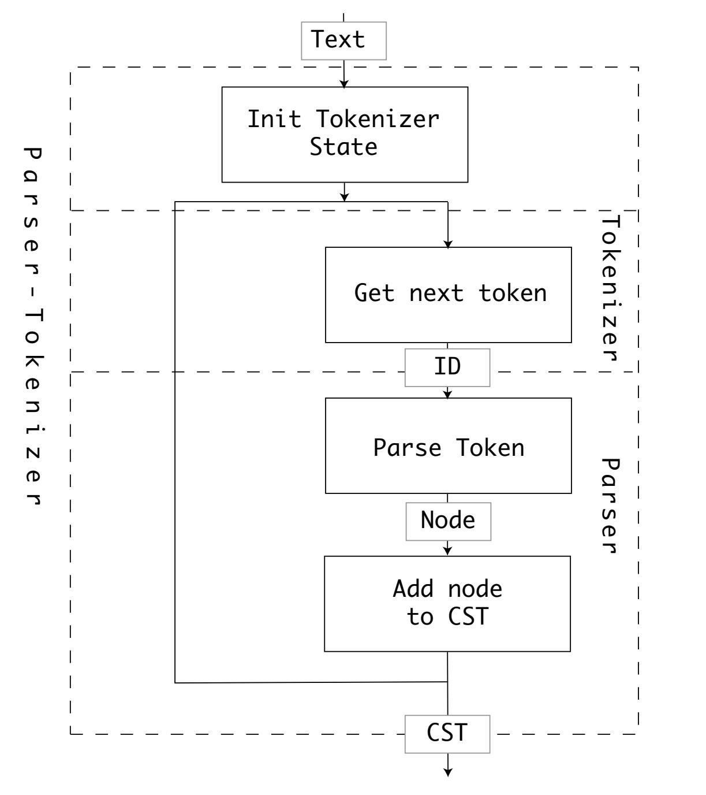

## <center>Парсинг и анализ исходного кода</center>

### Лексический и синтаксический разбор при помощи синтаксических деревьев
Для анализа кода в CPython используются две структуры, **Concrete
Syntax Tree** (**CST**, дерево синтаксического парсинга) и **Abstract Syntax Tree**(**AST**, синтаксическое дерево).


## Получение дерева разбора (CST)

Процесс вызова разбиения на лексемы и синтаксического анализа можно проиллюстрировать следующим образом:


Сначала код разбивается на лексемы, все лексемы определены в [`Grammar/Tokens`](https://github.com/python/cpython/blob/bb3e0c240bc60fe08d332ff5955d54197f79751c/Grammar/Tokens):

```txt
ENDMARKER
NAME
NUMBER
STRING
NEWLINE
INDENT
DEDENT

LPAR                    '('
RPAR                    ')'
LSQB                    '['
RSQB                    ']'
COLON                   ':'
COMMA                   ','
SEMI                    ';'
PLUS                    '+'
MINUS                   '-'
STAR                    '*'
[...]
```
К примеру, токен `NAME` представляет собой название некой переменной, функции, класса или модуля.
<br>[tokenize](https://github.com/python/cpython/blob/3.9/Lib/tokenize.py) Модуль, который представляет лексический парсер исходного кода Python, реализованный на Python.
```python
Whitespace = r'[ \f\t]*'
Comment = r'#[^\r\n]*'
Ignore = Whitespace + any(r'\\\r?\n' + Whitespace) + maybe(Comment)
Name = r'\w+'

Intnumber = group(Hexnumber, Binnumber, Octnumber, Decnumber)
Exponent = r'[eE][-+]?[0-9](?:_?[0-9])*'
Pointfloat = group(r'[0-9](?:_?[0-9])*\.(?:[0-9](?:_?[0-9])*)?',
                   r'\.[0-9](?:_?[0-9])*') + maybe(Exponent)
Expfloat = r'[0-9](?:_?[0-9])*' + Exponent
Floatnumber = group(Pointfloat, Expfloat)
Number = group(Imagnumber, Floatnumber, Intnumber)
```

Потом используется LL-грамматика, определённая в [`Grammar/python.gram`](https://github.com/python/cpython/blob/main/Grammar/python.gram).

```gram
# Arithmetic operators
# --------------------

sum[expr_ty]:
    | a=sum '+' b=term { _PyAST_BinOp(a, Add, b, EXTRA) }
    | a=sum '-' b=term { _PyAST_BinOp(a, Sub, b, EXTRA) }
    | term

term[expr_ty]:
    | a=term '*' b=factor { _PyAST_BinOp(a, Mult, b, EXTRA) }
    | a=term '/' b=factor { _PyAST_BinOp(a, Div, b, EXTRA) }
    | a=term '//' b=factor { _PyAST_BinOp(a, FloorDiv, b, EXTRA) 
```

Потом строится дерево парсинга. То есть **CST**—это просто отображение грамматики в древовидную форму.

Перейдём к реальному примеру.  Рассмотрим как, простое арифместическое выражение `a + 1` превращается в дерево парсинга (**CST**):

Выражение разбилось на следующие лексемы:

<details><summary>Разбиения на токены:</summary>

```python
from tokenize import tokenize
from io import BytesIO
from token import tok_name
from pprint import pprint

tokens = tokenize(BytesIO(b"a+1").readline)
pprint([(token.string, tok_name[token.type]) for token in tokens])
```
</details>

```python
[('utf-8', 'ENCODING'),
('a', 'NAME'),
('+', 'OP'),
('1', 'NUMBER'),
('', 'NEWLINE'),
('', 'ENDMARKER')]
```

<details><summary>Печать дерева синтаксического анализа</summary>

```python
from symbol import sym_name
from token import tok_name
import parser
from pprint import pprint

def lex(expression):
    lexicon = tok_name | sym_name
    st = parser.expr(expression)
    st_list = parser.st2list(st)

    def replace(l: list):
        r = []
        for i in l:
            if isinstance(i, list):
                r.append(replace(i))
            else:
                if i in lexicon:
                    r.append(lexicon[i])
                else:
                    r.append(i)
        return r

    return replace(st_list)
pprint(lex('a + 1'))
```
</details>

```python
>>> pprint(lex('a + 1'))
['eval_input',
 ['testlist',
  ['test',
   ['or_test',
    ['and_test',
     ['not_test',
      ['comparison',
       ['expr',
        ['xor_expr',
         ['and_expr',
          ['shift_expr',
           ['arith_expr',
            ['term',
             ['factor', ['power', ['atom_expr', ['atom', ['NAME', 'a']]]]]],
            ['PLUS', '+'],
            ['term',
             ['factor',
              ['power', ['atom_expr', ['atom', ['NUMBER', '1']]]]]]]]]]]]]]]]],
 ['NEWLINE', ''],
 ['ENDMARKER', '']]
```
В данном выводе можно наблюдать символы в нижнем регистре, полученные из LL-грамматики, например, `arith_expr`, и значения лексем в верхнем регистре, такие как `NUMBER`.

В итоге получилось следующее дерево парсинга:


